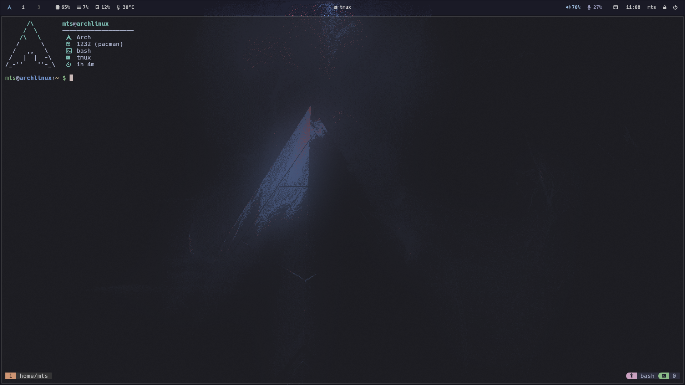

# .dots

My personal dotfiles.

## System Info

- **Distro**: [Arch](https://wiki.archlinux.org/)
- **Wayland Compositor**: [Hyprland](https://hyprland.org/)
- **Bar**: [Waybar](https://github.com/Alexays/Waybar)
- **Notifications**: [dunst](https://dunst-project.org/)
- **Application Launcher**: [rofi](https://github.com/davatorium/rofi)
- **Dots Manager**: [dotdrop](https://github.com/deadc0de6/dotdrop)
- **Shell**: bash with [oh-my-bash](https://github.com/ohmybash/oh-my-bash)
- **Font**: [Hack Nerd Font](https://www.nerdfonts.com/font-downloads)
- **Terminal**: [kitty](https://sw.kovidgoyal.net/kitty/)
- **Text Editor**: [neovim](https://neovim.io/) with
  [NvChad](https://nvchad.com/)
- **Theme**: Adwaita-dark
- **Icons Theme**:
  [Papirus-Dark](https://github.com/PapirusDevelopmentTeam/papirus-icon-theme)
- **Cursor Theme**:
  [Catppuccin-Mocha-Dark](https://github.com/catppuccin/cursors)

## Inspiration
- https://github.com/SolDoesTech/HyprV4
- https://github.com/Vallen217/dotfiles/
